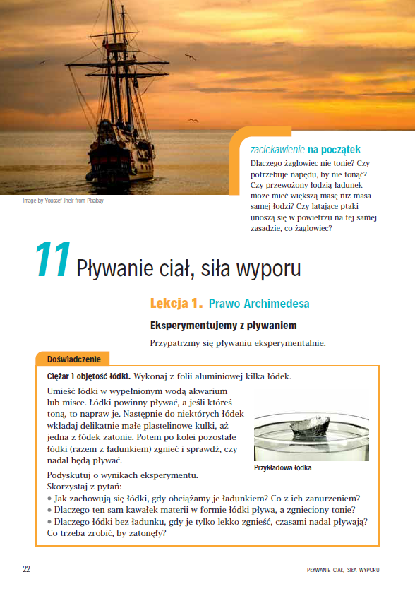
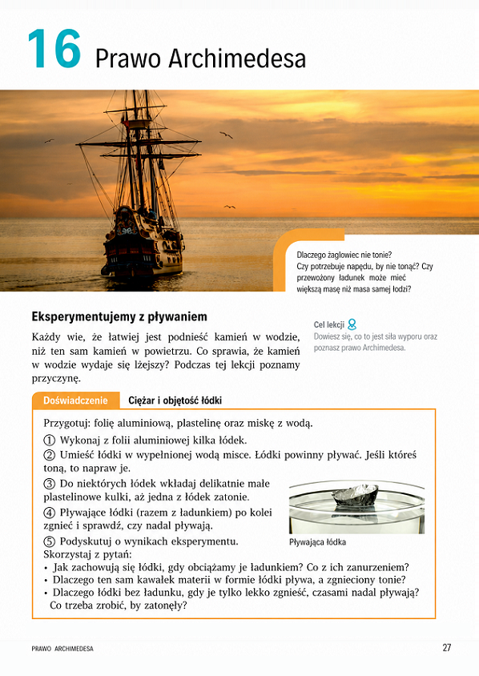

# From Teacher Research to 7% National Adoption: Launching a New Physics Textbook Series

### Content & Product Case Study

`Status: Shipped` `Domain: Publishing / EdTech` `Market: Poland, primary school physics, grades 7–8 (2021–2025)`  
`Methods: Surveys / Focus Groups / Prototyping / Team & Freelancer Management`

I led the development and launch of a new physics textbook series based on research with 1,150+ teachers. In the 2023 adoption round, 7% of Polish physics teachers chose the series, making it the publisher's best-performing new subject launch.

The starting position was challenging: the publisher's previous physics series had remained niche, while one competitor dominated textbook usage among the teachers we surveyed (over 80%).

****

**[Read the full case study →](case-study.md)**

## 🎯 At a glance

| | |
|---|---|
| **My role** | Managing Editor, leading product development from research to launch |
| **Scope** | Textbook series, worksheets, experiment videos, curated interactive simulations, teacher guides, tests, digital editions |
| **Team** | 9 contributors: 5 external (2 authors, 2 subject consultants, 1 video producer) and 4 in-house (3 graphic designers, 1 DTP specialist), plus an external panel of 4–6 teachers in focus groups |
| **Result** | Best-performing new subject launch · chosen by 7% of Polish physics teachers (2023) |

## 🛠️ What I did

- **Research:** planned the teacher surveys with the promotions team, then observed 3 focus groups and ran 10+ myself: 4 with varied groups of teachers, the rest with a panel of 4-6 (grade 7–8 physics teachers).
- **Team:** rebuilt the external author and consultant team around experienced primary-school teachers, sourced through teacher communities, personal networks and our own focus groups. I agreed budgets with authors, consultants and the focus panel.
- **Go-to-market content:** created print and digital sample materials (textbook excerpts, interactive tests, test-generator previews) distributed by the promotions team.

## 🔍 Research → decisions

| What teachers told us | What I changed |
|---|---|
| 40%+ couldn't finish the grade 7 syllabus, and students return textbooks at year-end | Moved part of the grade 7 content to grade 8 and made it available digitally |
| ~90% named experiment recordings as their most important classroom material | Made experiment videos a core part of the package |
| ~60% wanted simpler language | Simplified the mathematical language, then simplified it further after focus groups |

## 🖼️ Layout before and after

Before full production, I tested a prototype with teachers in focus groups. In one round we compared two page layouts side by side: the existing one and a version I revised with a DTP specialist for readability. Teachers' comments and ratings guided the final layout.

<table>
  <tr>
    <th>Before the focus groups</th>
    <th>After the focus groups</th>
  </tr>
  <tr>
    <td></td>
    <td></td>
  </tr>
</table>

## 📬 Contact

**Kamila Woronicz** 
Product Project Manager | Business Analyst  
<kamila.woronicz@gmail.com>

---

**README** · [Full case study →](case-study.md)
