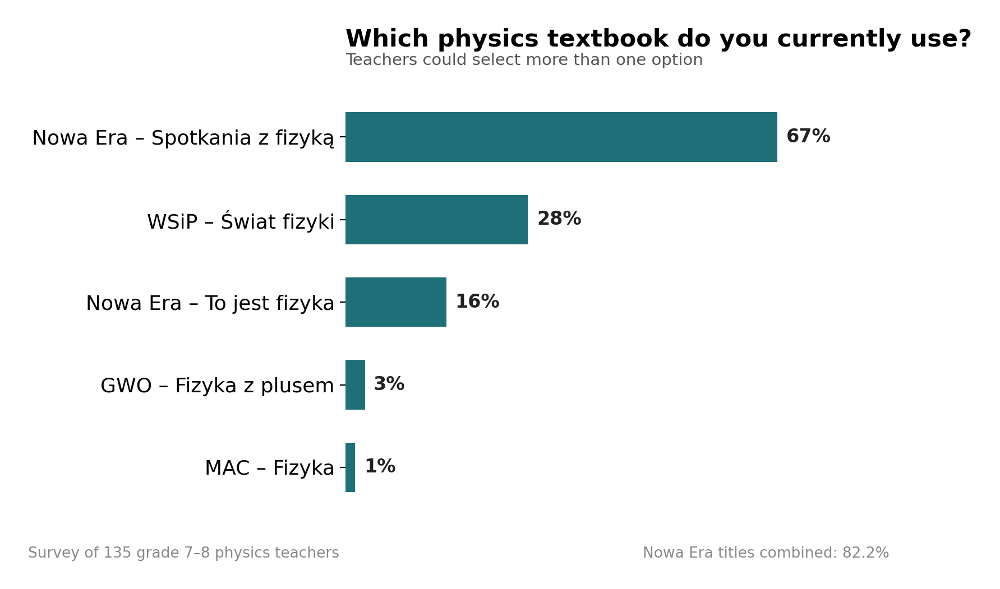
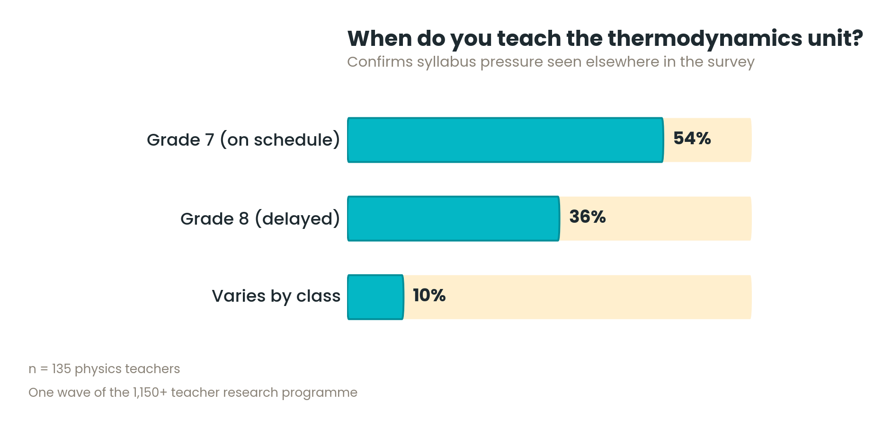
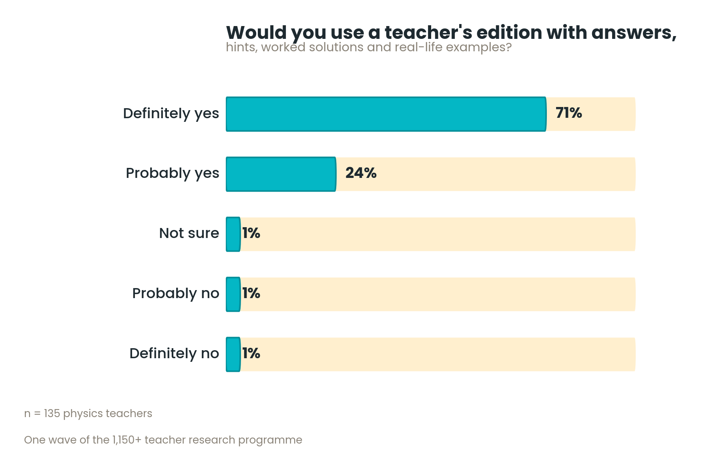

# From Teacher Research to a Best-Performing Physics Textbook Series

### Full Case Study

`Status: Shipped` `Domain: Publishing / EdTech` `Market: Poland, primary school physics, grades 7–8 (2021–2025)`  
`Methods: Surveys / Focus Groups / Prototyping / Team & Freelancer Management`

[← Back to summary](README.md)

---

## 1. Starting point

The publisher already had a physics series. It had been distinguished by the [Polish Academy of Arts and Sciences](https://en.wikipedia.org/wiki/Polish_Academy_of_Arts_and_Sciences), but it was niche: few teachers chose it. In our surveys, teachers associated it with ambitious content for gifted students.

My reading of the feedback was different. The content was strong, but the book was hard to navigate: key content was not highlighted well, and it was difficult to see where one lesson ended and the next began. Teachers called the book "ambitious." The barrier I saw was usability.

The market made the task harder:

- **Textbooks are chosen once every three years.** A missed adoption round means waiting for the next one.
- **The decision-maker differs from school to school.** Sometimes it is the physics teacher, sometimes the coordinator of the physics team, and sometimes the head teacher, who may choose a publisher for the benefits it offers across subjects.
- **A strong incumbent.** Over 80% of surveyed teachers used the offer of the market leader in primary-school science textbooks. It covers chemistry, biology, geography and physics, and gives schools extra benefits (for example, free materials or large geography maps) when they choose its books across several subjects.

On the other side, my employer is the market leader in mathematics textbooks, with a highly-regarded series and a market share above 80%, a very different position from its weak standing in physics at the time. Some mathematics teachers also teach physics, which let us run extensive research with this group.

## 2. The challenge

The goal was not to publish another textbook, but to build a series that teachers would actively choose and use. That required answering four questions:

- How do teachers actually run their physics lessons?
- Which parts of the curriculum cause the most difficulty?
- What stops teachers from using existing materials effectively?
- What extra tools would make lesson preparation easier?

There was a second challenge: the team. When I joined, a team was already in place: one author, who had written the first lessons, and two subject consultants, who had reviewed them. Their experience came from university teaching (the author), from upper-secondary and technical school (subject consultant #1), and from a private primary school with gifted students and a very well-equipped physics lab (subject consultant #2). None of it reflected the ordinary grade 7–8 classroom, where most of our target teachers work. I judged that a product built by this team would not fit the market, and I decided to fix the team before fixing the content.

## 3. My role

I worked on the project from research to launch and took on more ownership as it progressed. In the end I coordinated the development of the whole product. My responsibilities:

- planning the teacher surveys with the promotions department and analysing the results,
- running the focus groups (I observed 3, then ran 10+ myself),
- rebuilding the external author and consultant team,
- agreeing budgets with authors, consultants and the focus panel,
- revising the textbook layout with a DTP specialist and discussing teachers' feedback with the layout's original author,
- editing the material itself, together with the team: text, photos and illustrations,
- preparing sample materials for the promotions team,
- coordinating authors, consultants, graphic designers, DTP and the video producer,
- overseeing the supplementary print and digital content and its digital publication in the CMS.

## 4. Audience research

Together with the promotions department, I defined what we needed to learn from teachers before writing a single lesson. The research combined surveys, interviews and qualitative methods and reached **1,150+ physics teachers**.

Headline findings:

- **40%+** of teachers could not complete the grade 7 syllabus on time. Students return their textbooks at the end of the year, so topics continued in grade 8 had no book to go with them.

  
- **90%+** of teachers wanted a teacher's guide, and **95%** said they would definitely or probably use one.

  
- **~60%** wanted simpler language than in the textbooks they currently used.
- **~90%** named recordings of physics experiments as the most important material they use in class, and for some it matters more than the textbook itself.

### From insight to product decision

| What the research showed | Product decision |
|---|---|
| 40%+ of teachers could not finish the grade 7 syllabus, and students have no textbook for topics continued in grade 8 | Moved part of the grade 7 content to grade 8 and made it available digitally for flexible use |
| ~60% of teachers wanted simpler language | Simplified mathematical language (and simplified further after the focus groups) |
| ~90% of teachers named experiment recordings as their most important classroom material | Experiment videos as a core part of the package |
| 90%+ of teachers wanted a teacher's guide | Teacher guides as part of the series |
| Students struggled with mathematical transformations | Algebraic transformations moved closer to the point where they are needed, with extra scaffolding |
| Many schools lacked specialised lab equipment | Experiments designed around simple, accessible materials |
| Teaching preferences vary: some teachers rely on worksheets rather than textbooks | A worksheet alternative for every lesson |

[Check that each decision was really a response to this finding, and adjust the table if not.]

## 5. Rebuilding the team

| Before | After |
|---|---|
| 1 author and 2 consultants, none with mainstream primary-school classroom experience | 2 authors and 2 consultants with relevant classroom experience, plus a standing focus panel |

What I did:

- **Added a second author:** a long-serving primary-school teacher.
- **Replaced the consultants** with people who had the right classroom experience.
- **Sourced people through teacher channels:** a Facebook group for physics teachers, personal networks and referrals. One consultant came directly from our focus groups.
- **Agreed budgets** with authors, consultants and the focus panel.
- **Built a permanent feedback loop:** a regular focus panel of up to 6 grade 7–8 physics teachers who reviewed the materials as they were developed.

What changed:

- **Consultants' comments became much more accurate** and reflected work with a standard student.
- **A second author sped up the work.** The authors could also review each other's materials, which improved quality.
- **Doubts could be settled on the spot.** A quick phone call with an experienced teacher was often enough. This was not possible with the consultants, but it was with the authors.
- **Some consultants stayed on longer:** they wrote items for the test generator and consulted on the experiment recordings.

## 6. Prototype and focus groups

Before full production, we built a prototype with sample lessons, workbook materials and experimental activities. I observed the first 3 focus groups and then ran 10+ myself:

- **4 sessions with different groups of teachers**, so that as many teachers as possible could look at the materials with fresh eyes,
- **the remaining sessions with the regular panel of 6 teachers**, who reviewed successive versions.

### Layout: two versions side by side

After the first few sessions it was clear that the existing layout was hard to navigate. With a DTP specialist, I prepared a revised version, and we showed teachers both layouts. They commented on and rated each. I then walked the layout's original author, a respected in-house designer, through the teachers' feedback. The conversation was constructive, partly because the changes were largely cosmetic: they improved the readability of the page, while the main elements stayed untouched.

<table>
  <tr>
    <th>Before the focus groups</th>
    <th>After the focus groups</th>
  </tr>
  <tr>
    <td></td>
    <td></td>
  </tr>
</table>

The lesson title moved to the top of the page. Headings, typefaces and colours were reduced. A learning goal was added, experiment steps were numbered, and every experiment got its own title.

### What changed after the focus groups

| What we learned | What we changed |
|---|---|
| The existing page layout was hard for teachers and students to navigate | Revised layout for readability, keeping the main elements. Teachers' comments and ratings of both versions guided the result |
| Lessons lacked a clear purpose from the student's point of view | Added a learning goal to every lesson: what the student will learn |
| Our first structure allowed 3 lessons on one topic to be merged into a larger block (one title, more content) | Rejected that idea: every lesson became a self-contained unit |
| Teachers were almost unanimously enthusiastic about humorous illustrations, not only photos, charts and diagrams | Kept and extended the use of humorous illustrations |
| The language of the textbook was still too mathematical | Simplified the mathematical language further than I had originally assumed |

## 7. What we shipped

You can browse the current textbook mockup on the publisher's website: [open the mockup](https://multipodreczniki.apps.gwo.pl/demos/f4b52037-e24b-43af-b1fd-ff2e690d762e?page=26).

- textbook series,
- student worksheets ([sample lesson worksheet](https://gwo.pl/lekcja15-cisnienie-hydrostatyczne-3/)) and experiment worksheets ([sample experiment worksheet](https://gwo.pl/zmiana-cisnienia-hydrostatycznego-wraz-z-wysokoscia-slupa-wody-2-2/)),
- instructional and experiment videos, recorded with an external video producer ([sample experiment recording](https://gwo.pl/przedmioty/fizyka/materialy-dydaktyczne/czas-na-doswiadczenie/lekcja-22-dzwiek-instrumenty-i-oscylogramy/)),
- interactive simulations: ready-made PhET simulations, curated and linked to specific lessons in the digital textbooks and other materials ([sample simulation](https://gwo.pl/przedmioty/fizyka/zaciekawiajmy-fizyka/eksperymentarium/obwody-pradu-stalego/)),
- teacher guides,
- tests and assessment materials, with items from consultants for the test generator,
- materials for students with additional educational needs,
- digital versions of the products, published through the CMS.

## 8. Sample materials for promotion

For the launch, I prepared sample materials in print and digital form: textbook excerpts, interactive tests and fragments of the test generator (which also worked as samples). The promotions department distributed them to teachers.

## 9. Results

- Research with **1,150+ teachers** before the product was designed.
- **10+ focus groups** that shaped the layout, structure, language and illustrations.
- A team of **9+ contributors**, rebuilt around experienced classroom teachers.
- The publisher's **best-performing new subject launch**.
- **7% of all physics teachers in Poland chose the series** in the 2023 adoption round, against a market leader used by over 80% of surveyed teachers. This is a share of teachers, not of students.
- The next adoption round took place in 2026. [Add the new share when it is available.]

## 10. Lessons learned

*(Draft. Edit so that it reflects what you actually took away.)*

- **Fix the team before the content.** The best research is wasted if the people writing the book do not know the real classroom.
- **Look behind the label.** Teachers called the previous series "ambitious", but the real barrier was usability.
- **Test structure early, not just text.** Layout and lesson structure were among the biggest changes after the focus groups.
- **A crowded market rewards a sharper product, not a louder one.** Against an 80%+ incumbent, the win came from fixing specific, research-backed problems (an unfinished syllabus, an unreadable layout, materials teachers actually wanted), not from trying to out-market it.

---

[← Back to summary](README.md)
